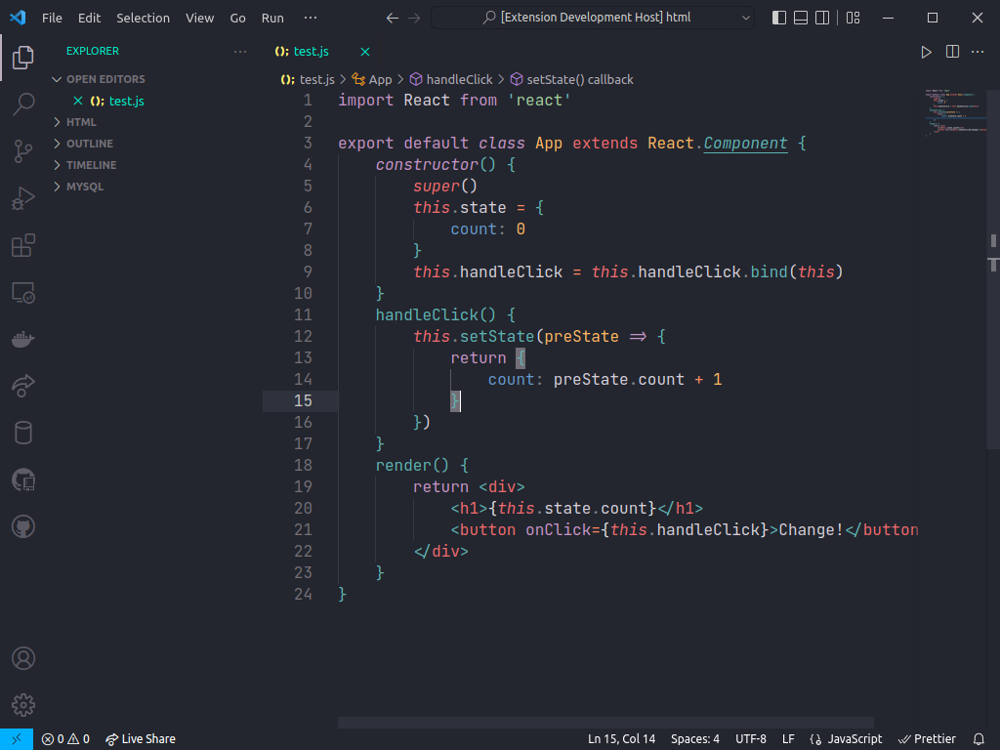

# Andromeda Mariana for VSCode
  

**Andromeda** `1.8.0` theme with the **Mariana** scheme(color syntax highlight) for those who like to have the Mariana scheme just like Sublime Text.

> **NOTE**: This theme includes a variant with italic keywords that looks great with fonts like Operator Mono or Catograph Mono

## Easy Installation

1. Open the extensions sidebar on Visual Studio Code
2. Search for **Andromeda Mariana Theme**
3. Click **Install** to install it.
4. Click **Reload** to reload your editor.
5. Code/File ＞ Preferences ＞ Color Theme ＞ **Andromeda Mariana**.
6. 🌟 Enjoy and [Rate five-stars](https://marketplace.visualstudio.com/items?itemName=myaaghubi.andromeda-mariana-vscode&ssr=false#review-details).

## License

[MIT](https://github.com/release/myaaghubi/Andromeda-Mariana-VSCode/blob/master/LICENSE.md)

